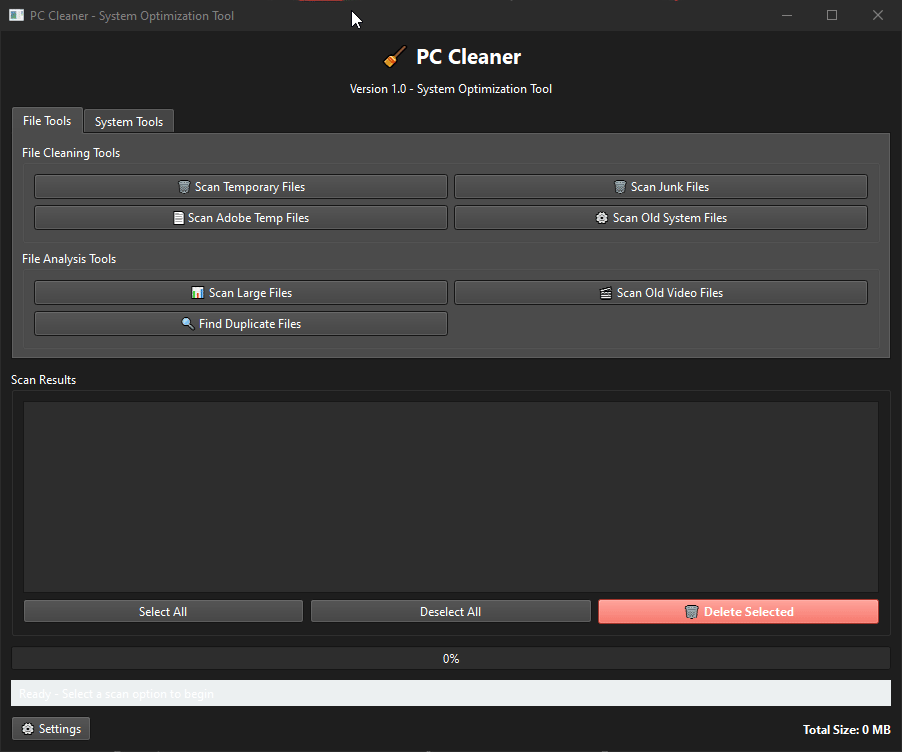

# pySystemCleaner

**Created by ZxPwd**

A comprehensive system cleaning and optimization tool for Windows. Built with Python and PyQt6 for a modern, user-friendly interface.



---

## Features

### File Cleaning Tools
- **Temporary Files Cleaner** - Remove Windows and application temp files
- **Junk Files Cleaner** - Clean up unnecessary junk files (.log, .tmp, .bak, etc.)
- **Adobe Temp Files** - Clear Adobe application cache and temp files
- **Old System Files** - Remove outdated Windows system files and installers

### File Analysis Tools
- **Large File Scanner** - Find files over a configurable size threshold
- **Old Video Scanner** - Locate old video files taking up space
- **Duplicate Finder** - Detect and remove duplicate files (MD5 hash comparison)

### System Optimization
- **DNS Cache Cleaner** - Flush DNS resolver cache
- **Registry Cleaner** - Scan and fix registry issues (with automatic backup)

### User Interface
- **Tabbed Interface** - Organized tools in File Tools and System Tools tabs
- **Progress Tracking** - Real-time scan progress and status updates
- **Batch Selection** - Select all, deselect all, or pick individual items
- **Size Display** - See total size of detected files
- **Settings Dialog** - Customize scan thresholds and options

---

## Requirements

- **OS:** Windows 10/11
- **Python:** 3.8+
- **Dependencies:** PyQt6

---

## Installation

1. Clone the repository
   ```bash
   git clone https://github.com/ZxPwdz/pySystemCleaner.git
   cd pySystemCleaner
   ```

2. Install dependencies
   ```bash
   pip install -r requirements.txt
   ```

3. Run the application
   ```bash
   python main.py
   ```

**Windows Users:** Double-click `run.bat` to launch the application.

---

## Usage

1. **Select a Tool** - Choose from File Tools or System Tools tabs
2. **Run Scan** - Click a scan button to analyze your system
3. **Review Results** - View detected files/items in the results list
4. **Select Items** - Use Select All or click individual items
5. **Delete** - Click "Delete Selected" to remove chosen items

### Settings

Access settings via the gear button to configure:
- **Large File Threshold** - Minimum size for large file detection (default: 100 MB)
- **Video File Age** - Age threshold for old video detection (default: 365 days)
- **Registry Backup** - Create backup before registry cleaning (default: enabled)
- **Deep Scan** - More thorough but slower scanning (default: disabled)

---

## Project Structure

```
pySystemCleaner/
├── main.py                      # Main application entry point
├── requirements.txt             # Python dependencies
├── run.bat                      # Windows launcher script
├── modules/
│   ├── __init__.py
│   ├── temp_cleaner.py          # Temporary files cleaner
│   ├── junk_cleaner.py          # Junk files cleaner
│   ├── adobe_cleaner.py         # Adobe temp files cleaner
│   ├── large_file_scanner.py    # Large file detection
│   ├── duplicate_finder.py      # Duplicate file detection
│   ├── video_scanner.py         # Old video file scanner
│   ├── registry_cleaner.py      # Windows registry cleaner
│   ├── dns_cleaner.py           # DNS cache cleaner
│   └── system_cleaner.py        # System file cleaner
└── preview.gif                  # Application preview
```

---

## Tech Stack

- **Language:** Python 3
- **GUI Framework:** PyQt6
- **Style:** Fusion (modern Qt style)

---

## Safety Features

- **Confirmation Dialogs** - Prompts before any deletion
- **Registry Backup** - Automatic backup before registry modifications (saved to `Documents/PCCleaner_Backups/`)
- **Logging** - All operations logged to `pc_cleaner.log`
- **Error Handling** - Graceful handling of locked or protected files
- **Selective Deletion** - Choose exactly which files to delete

---

## Troubleshooting

| Issue | Solution |
|-------|----------|
| Application won't start | Ensure Python 3.8+ and PyQt6 are installed |
| "Permission Denied" errors | Run as Administrator for full system access |
| Some files can't be deleted | Close programs that might be using those files |
| Registry cleaner finds nothing | Your registry is already clean |

---

## Disclaimer

**Use at your own risk.** While this tool is designed to safely clean unnecessary files, always:
- Review items before deletion
- Keep the registry backup option enabled
- Ensure you have backups of important data

The author is not responsible for any data loss.

---

## License

MIT License

---

**Created by ZxPwdz**
